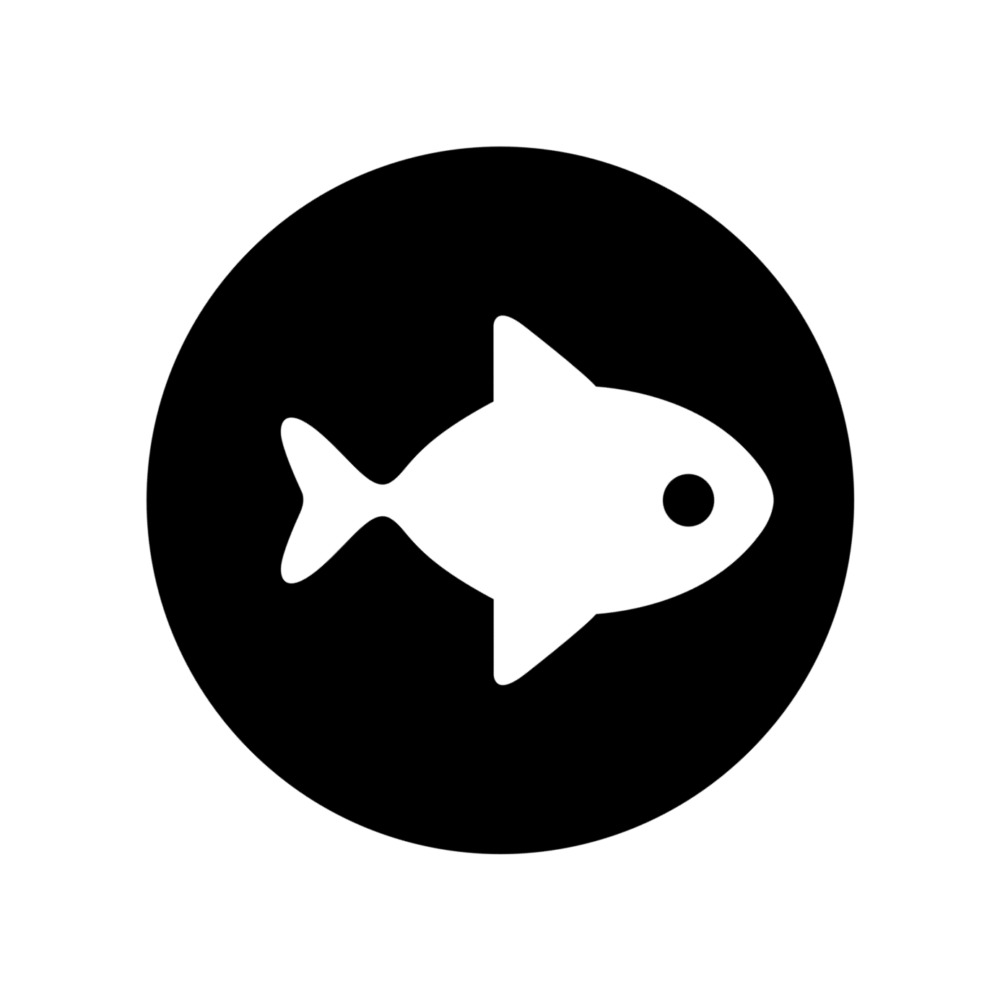

**luna**: library for unstructured adaptation
(c) Philip Claude Caplan, 2019



[](https://gitlab.com/philipclaude/luna/badges/master/build.svg)

**luna** is an unstructured mesh adaptation library with the following capabilities:

* dimension-independent mesh adaptation given a (1) mesh, (2) geometry description and (3) a metric field
* dimension-independent calculation of restricted Voronoi diagrams given (1) a set of sites and (2) a background mesh
* visualization of 2d, 3d and 4d meshes in the browser via (1) OpenGL and (2) websockets and WebGL

```
cd luna
mkdir build
mkdir build/release
cd build/release
cmake ../../
make luna
```

The libraries (**libluna.so** and **libluna.a** ) will be in **luna/build/release/lib**.

The main executable is **luna/build/release/bin/luna**.

Example 1: UGAWG Cube-Linear case
```
$ luna -adapt data/cube.mesh box Linear-3d tmp/cl.mesh
```

Example 2: UGAWG Cube-Cylinder Polar 2 case
```
$ luna -adapt ../data/cube-cylinder.mesh ../data/cube-cylinder.egads Polar2 ../tmp/ccp2.mesh
```

Example 3: mesh adaptation from a metric in a .solb file
```
luna -adapt input.mesh input.egads input.sol tmp/output.mesh
```

Example 4: visualization of a mesh (here, a 4d mesh from the Tesseract Wave case)
```
luna -plot wave.json
```

Notes:
* in ${EngSketchPad}/wvClient/WebViewer/wv-render.js, set 'preserveDrawingBuffer: true' so the canvas can be saved to png using toDataURL
* for linux: install xorg-dev if building the OpenGL visualizer
